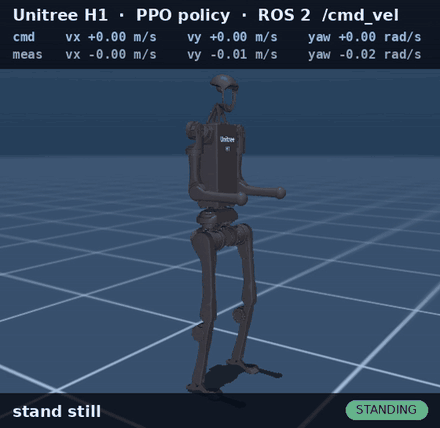
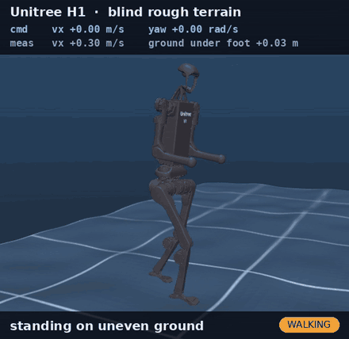
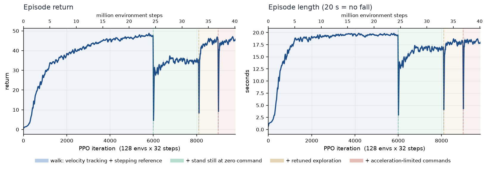

<h1 align="center">Unitree H1 — reinforcement-learning walking controller</h1>

<p align="center">
  PPO in <b>MuJoCo</b> → a <b>ROS 2</b> node that walks the H1 humanoid on <code>/cmd_vel</code>.<br/>
  Trained from scratch on 2 CPU cores. No Isaac Gym, no GPU required.
</p>

<p align="center">
  
  
  
  
  <a href="../../actions/workflows/ci.yml"></a>
</p>

<p align="center">
  
</p>

<p align="center"><sub>
  Real time, no cuts. <code>cmd</code> is the velocity command, <code>meas</code> the measured base velocity.
  <a href="docs/demo.mp4">Full clip (18 s, includes walk + turn and sideways stepping)</a>.
</sub></p>

---

The policy takes only signals a real H1 actually has — IMU and joint encoders — and outputs
joint targets for the 10 leg joints at 50 Hz. At zero command it **finishes the step it is
taking, puts both feet down and stands still**, balancing actively; the next command starts
it walking again.

```
       TRAINING  (no ROS, fast)                                 RUNTIME  (ROS 2 Jazzy)                  

+------------------------------------+        +----------------------------------------------------------+
| h1_rl.train                        |        | teleop_twist_keyboard  /  your nav stack                 |
|   128 MuJoCo H1s in parallel (CPU) | policy |             | /cmd_vel                                   |
|   PPO, asymmetric actor-critic     |------->|             v                                            |
|   velocity tracking + gait rewards |  .npz  | policy_controller           NumPy MLP, 50 Hz             |
|   domain randomization, pushes,    |        |   ^ /joint_states  ^ /imu/data   | /joint_commands       |
|   actuation delay, sensor noise    |        |   |                |             v  (q, dq, tau, kp, kd) |
+------------------------------------+        | mujoco_sim    H1 physics 200 Hz, viewer, /clock,         |
                                              |               /odom, /tf, motor watchdog, auto-reset     |
                                              +----------------------------------------------------------+
```

## Highlights

- **Walks and stands still.** Velocity tracking in all three axes plus a true standstill at zero
  command — the part most H1 demos skip, because the H1 topples if you just freeze its joints.
- **Deployment-shaped interface.** `h1_msgs/JointCommand` carries exactly what Unitree's `LowCmd`
  carries (position, velocity, torque, kp, kd), so the controller talks to the simulator the same
  way it would talk to the robot.
- **One config, no drift.** `config/h1_walk.yaml` is the single source of truth for training, the
  simulator and the controller; the exported `.npz` policy embeds the settings it was trained
  with, and a test asserts the deployed controller sees *exactly* the observations training
  produced (down to 1e-5) through stand ↔ walk transitions.
- **Trains on a laptop.** ~40 M steps ≈ 2 hours on 2 CPU cores. Physics runs multi-threaded in
  MuJoCo, the GPU (if any) only does the network updates.
- **Measured, not claimed.** `h1_rl.eval` runs the published robustness suites (stopping,
  standing, pushes, randomized episodes) and prints the exact table in this README; CI runs a
  quick version as a pass/fail gate on every push, alongside 11 pytest tests covering
  controller/env observation equality, sim/training physics equality and the policy export.
- **Tune with numbers.** `h1_rl.bench` sweeps environment counts against physics threads on your
  machine, times a PPO update on your GPU, and estimates the wall-clock of a full run.

## Quickstart

Requires **ROS 2 Jazzy on Ubuntu 24.04** (WSL2 works). Full install, including WSL and the
venv details: **[docs/SETUP.md](docs/SETUP.md)**.

```bash
git clone https://github.com/<you>/h1-rl-ros2.git ~/h1_rl_ws && cd ~/h1_rl_ws
python3 -m venv --system-site-packages ~/h1_venv && source ~/h1_venv/bin/activate
pip install -r requirements.txt                  # numpy<2, mujoco, pyyaml
source /opt/ros/jazzy/setup.bash
python -m colcon build --symlink-install         # use "python -m colcon", venv active
```

Run the pretrained policy (a MuJoCo window opens):

```bash
source ~/h1_rl_ws/env.sh                         # venv + ROS 2 + this workspace
ros2 launch h1_rl walk.launch.py
```

Drive it from a second terminal:

```bash
source ~/h1_rl_ws/env.sh
ros2 run teleop_twist_keyboard teleop_twist_keyboard
```

`i` forward · `,` backward · `j`/`l` turn · `J`/`L` sideways · `k` stop (→ stands still).
Trained range: vx ∈ [−0.6, 1.0] m/s, vy ∈ [±0.5] m/s, yaw ∈ [±1.0] rad/s; larger commands are
clipped, and all commands are acceleration limited (2 m/s², 4 rad/s²) so the robot has a step to
speed up or brake.

<details>
<summary>Other ways to run it</summary>

```bash
ros2 launch h1_rl walk.launch.py demo:=true            # scripted walk, no keyboard needed
ros2 launch h1_rl walk.launch.py rviz:=true            # RViz (robot model + odometry)
ros2 launch h1_rl walk.launch.py realtime_factor:=0.5  # slow motion for slow machines
ros2 launch h1_rl walk.launch.py policy:=/path/to/policy_latest.npz

ros2 topic hz /joint_commands                             # 50 Hz from the policy
ros2 topic echo /odom --field twist.twist.linear          # actual body velocity
ros2 service call /mujoco_sim/reset std_srvs/srv/Trigger  # put the robot back on its feet
```

Without ROS at all (MuJoCo viewer, arrow keys drive the robot):

```bash
cd src/h1_rl
python -m h1_rl.play                                                   # flat ground
python -m h1_rl.play --config config/h1_walk_terrain.yaml --terrain-level 5   # rough ground
```

`Up`/`Down` change forward speed, `Left`/`Right` the turn rate, `PageUp`/`PageDown` sideways,
`Home` stops (watch it settle into a still stance), `End` puts a fallen robot back on its feet.
Drag with the mouse to orbit; Ctrl+right-drag shoves the robot, which is the quickest way to see
a recovery step.

At start-up the simulator holds the pelvis in a virtual **support band** (like Unitree's elastic
band) and releases it on the first `/joint_commands` message. If the robot falls, the controller
switches to damping, the simulator auto-resets it after 2 s and the policy restarts once it is
upright.
</details>

## Results

Every number below comes from one command — `python -m h1_rl.eval` on the shipped policy, about
a minute on two cores. The full report is committed at
[docs/eval_report.md](docs/eval_report.md), and CI runs `--quick --check` of the same suites on
every push, so a regression fails the build instead of quietly shipping.

| Command | Achieved | | Robustness suite | Result |
|---|---|---|---|---|
| forward 0.5 m/s | 0.43 m/s | | stop from 0.3–1.0 m/s × 12 gait phases | **0 / 48 failures** |
| forward 0.8 m/s (range limit) | 0.71 m/s | | stand 12 s, sensor noise | **0 falls / 192 robots** |
| backward 0.5 m/s | 0.45 m/s | | stand 12 s, randomized dynamics | **0 falls / 192** |
| sideways ±0.4 m/s | ±0.27 m/s | | 0.4 and 0.8 m/s shove while walking | **12/12** and **12/12** |
| turn 0.8 rad/s | 0.74 rad/s | | 0.4 and 0.8 m/s shove while standing | **12/12** and **8/12** |
| zero | stands still, both feet down | | 20 s, everything randomized at once | 3 falls / 64 robots |

Mean absolute tracking error across the whole script, with 5 ms of actuation delay and no falls:
**0.037 m/s** (vx), **0.034 m/s** (vy), **0.020 rad/s** (yaw). Quiet standing is exactly that: the
robot spends **0.00%** of it stepping.

**The shipped policy is trained on rough terrain**, and that beats training on flat ground even for
flat-ground walking — better tracking in all three axes, 12/12 instead of 8/12 survival of a
0.4 m/s shove while standing, and no shuffling at all. The cost is the top of the speed range: the
terrain curriculum trains commands to 0.8 m/s rather than 1.0, so a 1.0 m/s command now yields
about 0.71 m/s where the flat-trained policy managed 0.89.

Shoved while standing it takes a recovery step rather than relying on ankles and hips alone (see
[Recovery steps](#how-it-works)); shoved while walking it survived every trial. The randomized
figure is the mean of four seeds — a single run of that suite scatters between 1 and 5 falls, which
is worth knowing before reading anything into one number.

### On rough terrain

<p align="center">
  
</p>

Blind — the policy sees no height map, only its own IMU and joint encoders.
`python -m h1_rl.eval --config config/h1_walk_terrain.yaml --suite terrain` walks 16 robots for
15 s at 0.5 m/s with randomized dynamics and sensor noise:

| curriculum level | relief | falls per robot-minute |
|---|---|---|
| plane (the flat scene) | — | **0.00** |
| 0 / 10 — *flat height field* | 0.000 m | 0.75 |
| 1 / 10 | 0.012 m | 1.00 |
| 5 / 10 | 0.060 m | 1.50 |
| 10 / 10 | 0.120 m | 3.25 |

Read that table carefully, because the interesting row is the flat one. A height field with **zero
relief** already costs 0.75 falls per robot-minute where a plane costs none — MuJoCo resolves
height-field contacts differently from plane contacts, and most of the difficulty the robot faces
here is that, not the bumps. Relief on top roughly doubles it again at full difficulty.

So: it walks blind over rough ground, and it is measurably less reliable there than on flat ground.
An earlier version of this README claimed it "passes every gate on rough terrain" — that was
measured with the curriculum at level 1, near-flat, using suites that mostly stand and stop. The
table above is what walking across it actually costs.

<p align="center"></p>

The shipped policy is 9800 PPO iterations (~40 M environment steps, ~2 h on 2 CPU cores). The
drops are deliberate: each stage adds a reward term or resets exploration noise and the policy
re-converges. It walks after ~500 iterations and survives full 20 s episodes after ~1500.

## How it works

**Robot.** `models/h1/h1.xml` is Unitree's H1 (51 kg, 19 actuated joints) with simple collision
shapes (4 spheres per foot). Every joint is a **PD servo inside MuJoCo**
(`τ = kp·(q* − q) − kd·q̇`, clipped to the motor torque limits) — the same impedance interface
the real motor drivers expose. Gains are Unitree's RL gains (hip 150, knee 200, ankle 40, …).

**Policy.** 50 Hz, 3-layer MLP (256-128-64, ELU), 10 leg joints; torso and arms are held at their
default pose. The output is a *correction on top of a stepping reference*:

```
target = default pose + reference(gait phase) + 0.25 × action
```

The reference is a plain stepping-in-place motion (the swing leg bends hip/knee/ankle in a
half-sine, timed by a 0.8 s gait clock). The network learns balance, foot placement and velocity
tracking on top of it. Without the reference the robot first discovers standing still and needs
far more samples to find stepping.

**Standing still.** The gait clock is an exact integer tick counter. At zero command it keeps
running to the next double-support instant (both feet down) and stops there; the first non-zero
command restarts it. Combined with acceleration-limited commands, the robot always has a step
left to brake with. Penalizing motion while standing was tried and made it *worse* — the policy
needs those small ankle/hip corrections to stay upright.

**Recovery steps.** A stopped clock means no stepping, and a hard enough shove then tips the robot
over. So a disturbance restarts the clock for 0.4 s — one half cycle — after which it stops in
double support again on its own. The trigger is the interesting part: a standing H1 holds a tilt of
its own (|gravity_xy| ≈ 0.065) that drifts, so an absolute angle either fires constantly or never
fires. Comparing the tilt against a slow moving average separates cleanly — quiet standing stays
under 0.075, a 0.4 m/s shove reaches 0.28:

| trigger | standing shoves survived | stepping while standing quietly |
|---|---|---|
| none (clock stays stopped) | 10 / 24 | 0% |
| absolute tilt > 0.10 | 13 / 24 | 99.8% — marches in place |
| **Δtilt vs slow average > 0.09** | **13 / 24** | **1.5%** |

The trainer and the deployed controller run the same detector on the same IMU signals, so their
gait clocks stay identical — a test asserts that tick by tick.

**Observations** (41 values × last 5 frames): IMU angular velocity, gravity direction, command,
leg joint angles and velocities, previous action, gait clock (sin/cos). No ground-truth velocity
— the critic gets that as privileged information, the actor never does.

**Training.** PPO with an asymmetric actor-critic. Rewards follow Unitree's `unitree_rl_gym` H1
recipe (velocity tracking, contact-vs-gait-clock matching, swing-foot clearance, penalties on
tilt, action rate, torques, joint limits) plus a small reference-tracking term as in
Humanoid-Gym. Randomization: friction 0.4–1.25, pelvis mass −1…+3 kg, CoM ±2 cm, ±10 % PD gains,
0–10 ms actuation delay, random pushes, sensor noise.

### ROS 2 interface

| Node | Topic / service | Type | Notes |
|---|---|---|---|
| `mujoco_sim` | pub `/joint_states` | `sensor_msgs/JointState` | 200 Hz, all 19 joints |
| | pub `/imu/data` | `sensor_msgs/Imu` | pelvis IMU |
| | pub `/odom`, `/tf` | `nav_msgs/Odometry` | ground truth, `odom → pelvis` |
| | pub `/clock` | `rosgraph_msgs/Clock` | run other nodes with `use_sim_time:=true` |
| | sub `/joint_commands` | `h1_msgs/JointCommand` | per-joint q, dq, τ, kp, kd |
| | srv `~/reset`, `~/set_support` | `Trigger`, `SetBool` | |
| `policy_controller` | sub `/joint_states`, `/imu/data`, `/cmd_vel` | | holds the last command (`cmd_vel_timeout` > 0 to stop after N s) |
| | pub `/joint_commands` | `h1_msgs/JointCommand` | 50 Hz |
| | srv `~/enable` | `SetBool` | |

## Repository layout

| Path | What it is |
|---|---|
| `src/h1_rl/config/h1_walk.yaml` | **Single source of truth**: joints, PD gains, rewards, randomization, PPO |
| `src/h1_rl/h1_rl/envs/h1_walk.py` | Batched, multi-threaded MuJoCo training environment |
| `src/h1_rl/h1_rl/ppo.py`, `train.py` | PPO, asymmetric critic, TensorBoard logging, checkpoints |
| `src/h1_rl/h1_rl/obs.py` | Observation + gait-clock code shared by training and deployment |
| `src/h1_rl/h1_rl/controller.py` | The deployed controller (pure NumPy, no ROS, no PyTorch) |
| `src/h1_rl/h1_rl/eval.py` | Evaluation suites behind the results table, with CI gates |
| `src/h1_rl/h1_rl/bench.py` | Throughput benchmark: envs × threads, PPO update, run estimate |
| `src/h1_rl/h1_rl/terrain.py` | Periodic height-field patches for the rough-terrain curriculum |
| `src/h1_rl/h1_rl/distill.py` | DAgger distillation of a privileged teacher into a blind student |
| `src/h1_rl/config/h1_walk_arms.yaml` | Variant: all 19 joints in the action space |
| `src/h1_rl/config/h1_walk_terrain.yaml` | Variant: blind rough terrain with a curriculum |
| `src/h1_rl/config/h1_walk_teacher.yaml` | Variant: privileged actor, to be distilled |
| `src/h1_rl/h1_rl/nodes/` | ROS 2 nodes: `mujoco_sim`, `policy_controller`, `cmd_vel_demo` |
| `src/h1_rl/models/h1/` | H1 MuJoCo model, URDF for RViz, meshes |
| `src/h1_rl/policies/h1_walk.npz` | Pretrained policy used by default (weights + training settings) |
| `src/h1_msgs` | `JointCommand.msg`, the Unitree-style impedance command |
| `src/h1_rl/test/test_core.py` | The test suite |

## Train your own

```bash
source ~/h1_rl_ws/env.sh
pip install -r requirements-train.txt    # once: PyTorch, TensorBoard
cd src/h1_rl && python -m h1_rl.train     # physics on all CPU cores, PPO on the GPU if present
tensorboard --logdir logs                 # http://localhost:6006
```

```bash
python -m h1_rl.train --num-envs 256                       # more parallel robots on a bigger CPU
python -m h1_rl.train --set rewards.scales.torques=-1e-5   # override any config key
python -m h1_rl.train --resume logs/h1_walk/<run>/model_3000.pt --iterations 8000
python -m h1_rl.export --checkpoint logs/h1_walk/<run>/model_9800.pt --output policies/h1_walk.npz
python -m h1_rl.play --policy logs/h1_walk/<run>/policy_latest.npz --headless   # tracking report
```

Before a long run, see what your machine can actually do:

```bash
python -m h1_rl.bench                      # sweeps env counts x physics threads, estimates a full run
python -m h1_rl.bench --json bench.json    # same, saved for comparing machines
```

**More physics threads is not better.** MuJoCo's Python binding holds the GIL around every
`mj_step` and the per-step NumPy work runs on the main thread, so throughput peaks at a handful of
threads and then collapses. Measured on a 20-thread i9-13900H with 128 robots:

| physics threads | 1 | 2 | 4 | 8 | 20 |
|---|---|---|---|---|---|
| `env.step()`, env steps/s | 15,074 | — | **24,449** | — | 6,953 |
| `mj_step` only, env steps/s | 16,004 | 31,645 | **59,315** | 53,750 | 38,844 |

Because of that, `h1_rl.train` measures a few thread counts once per machine (cached in
`~/.cache/h1_rl`) and uses the fastest; `--threads N` overrides it. The second row also shows the
headroom: physics itself scales to ~4x, and what caps the env is its own Python.

Checkpoints are exported automatically every 100 iterations. Standing robustness varies between
nearby checkpoints, so score a few late ones against each other instead of taking the last:

```bash
python -m h1_rl.eval --policy policies/h1_walk.npz --json shipped.json          # baseline
python -m h1_rl.eval --policy logs/h1_walk/<run>/policy_latest.npz \
                     --compare shipped.json                                     # candidate vs baseline
```

**Tests** (no ROS needed): `pytest` from the repo root, or `cd src/h1_rl && python -m pytest test -q`.

## Training variants

The shipped policy drives the legs on flat ground. Three variants reuse the same environment,
controller, tests and evaluation — each is one config file:

```bash
cd src/h1_rl
python -m h1_rl.train --config config/h1_walk_arms.yaml       # 19 joints: legs, torso, arms
python -m h1_rl.train --config config/h1_walk_terrain.yaml    # blind rough terrain
python -m h1_rl.train --config config/h1_walk_teacher.yaml --run-name teacher   # privileged
python -m h1_rl.distill --teacher logs/h1_walk/teacher/model_4000.pt            # ...then distil
```

**Whole body** (`h1_walk_arms.yaml`). The action space becomes all 19 joints, and the stepping
reference gains an arm swing: the opposite arm goes forward with each leg, which is what the sign
of `shoulder_pitch` and `hip_pitch` in the H1 model works out to. An upper-body term keeps the
torso and arms near that reference instead of flailing. The adaptive learning rate compares a KL
that is *summed over action dimensions*, so `desired_kl` is raised with the action count.

**Rough terrain** (`h1_walk_terrain.yaml`). Every robot gets its own height field — smooth noise,
waves or blocky steps — with a ten-step curriculum that promotes a robot when it covers the
distance it was asked to and demotes it when it falls early. The patches are **periodic**: a robot
that walks past the edge is moved back by exactly one period, and the ground under its feet does
not change, so a 20 s episode does not need a 20 m terrain. Base height, foot clearance and the
fall test are all measured against the ground under the robot, and the critic gets a privileged
3×3 height scan while the actor stays blind.

**Teacher and student** (`h1_walk_teacher.yaml` + `h1_rl.distill`). `ppo.privileged_actor` hands
the actor the same simulator state the critic sees — true base velocity, contacts, friction, added
mass, terrain scan — which learns faster but cannot run on a robot. `h1_rl.distill` then trains a
proprioceptive student on the states the *student* visits, with the teacher labelling each one
(DAgger), and writes an ordinary checkpoint that `h1_rl.export`, `h1_rl.eval` and the ROS 2
controller all accept unchanged.

## Roadmap

- **Train the variants above to convergence** — the code and the curricula are in, the long runs
  are not (roughly 40 minutes each per 40M steps on a recent laptop CPU).
- **Benchmark against Unitree's pretrained H1 policy** in this same simulator.
- **`unitree_ros2` bridge** — `h1_msgs/JointCommand` already mirrors `LowCmd`.
- **Stairs with a fixed rise** rather than the blocky steps the generator makes today.

## Before you try this on a real H1

This policy is trained and validated **in simulation only**. Sim-to-real for a 51 kg humanoid is
a safety-critical step, not a config change. At minimum: motor system identification, sim-to-sim
validation against a second simulator, much wider domain randomization, a bridge with torque and
velocity limits, command ramping and a damping fallback, a real-time Linux host (not WSL), and
first tests on a gantry with a second person on the e-stop.

## Credits and license

H1 meshes and inertial parameters © Unitree Robotics, BSD-3-Clause
([`src/h1_rl/models/h1/LICENSE`](src/h1_rl/models/h1/LICENSE)), obtained via MuJoCo Menagerie /
LocoMuJoCo. Reward design follows Unitree's [`unitree_rl_gym`](https://github.com/unitreerobotics/unitree_rl_gym);
the stepping-reference idea comes from [Humanoid-Gym](https://github.com/roboterax/humanoid-gym);
the PPO implementation follows [`rsl_rl`](https://github.com/leggedrobotics/rsl_rl) in spirit.

Everything in this repository is BSD-3-Clause — see [LICENSE](LICENSE).
